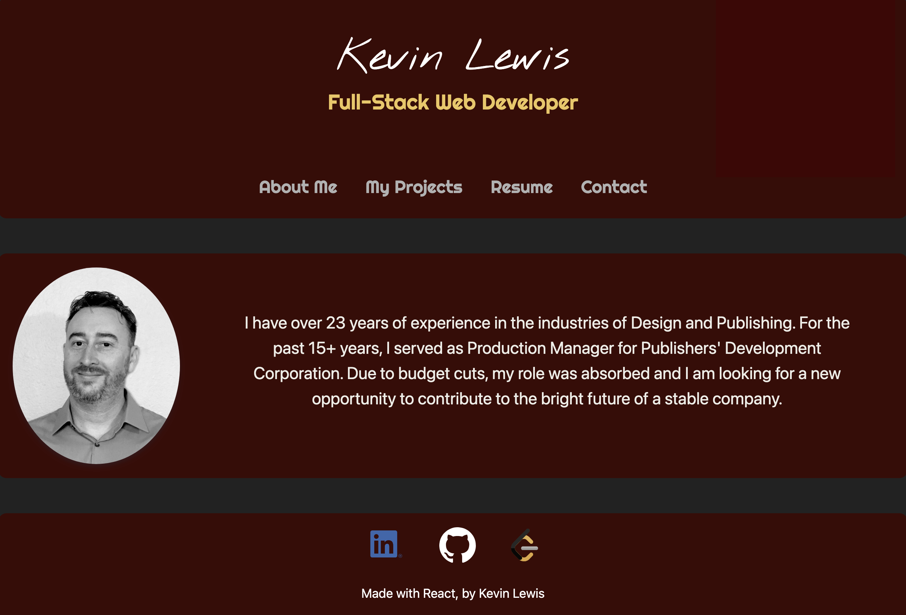
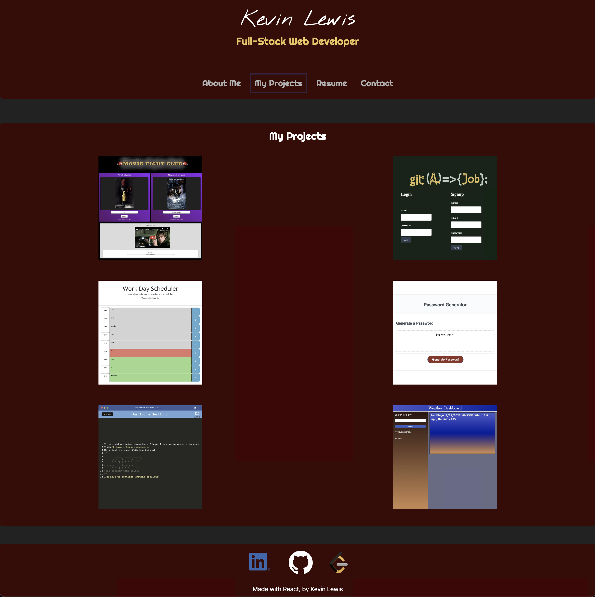
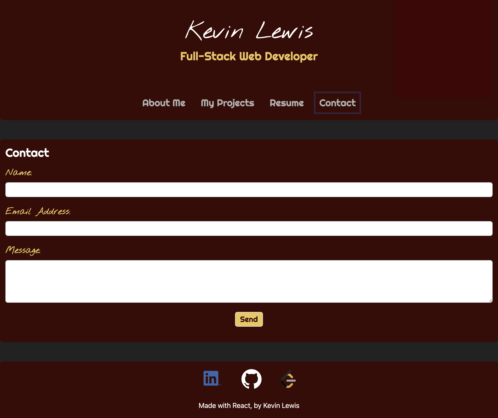

# ***Kevin Lewis' "React" Portfolio***

 

## Overview
This portfolio is intended to showcase my work as a Full-Stack Developer and provide a resume and contact information for prospective employers.

 

## Live Application Link
To view this portfolio, visit https://vermillion-faloodeh-87eaaf.netlify.app/

 

## Screen-Caps of the Application

##
 

##
 

##
 

 

## Contributors To This Application
Kevin Lewis

 

# ***Thank you for using this App!***

 

## Questions? Contact the Developer on GitHub... 
KPL33
## ...or via Email
kevinsname2003@yahoo.com